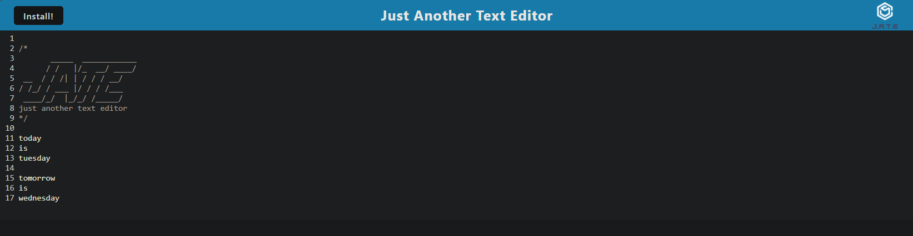
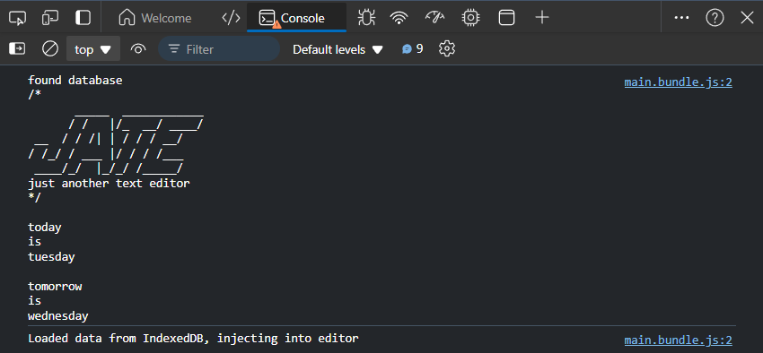

# tenacious-test-taker
## Description
Tenacious Text Taker (TTT) is a Progressive Web Application (PWA) designed to function as a versatile text editor. This single-page application leverages various data persistence techniques to ensure that users can create notes or code snippets both online and offline, providing reliable data retrieval. It meets the PWA criteria and is built to work seamlessly across different browsers and environments.This small project was an exercise to better understand the PWAs and the usage of indexed databases as storage.

## Installation
Access the deployed URL on [render](https://text-editor-9xtb.onrender.com/) or simply download the files provided by the application's [repo](https://github.com/Kushonim/tenacious-text-taker).

## Usage
The Tenacious Text Taker (TTT) offers a robust set of features to enhance your text editing experience. It works seamlessly both online and offline, automatically saving your content using IndexedDB for reliable data persistence. You can install the application as a Progressive Web App (PWA) to use it like a native desktop app. The service worker ensures that assets are cached, providing offline functionality and quick load times. Simply open the application in your browser, start typing notes or code snippets, and your content will be saved and synchronized. The application leverages modern JavaScript to ensure smooth and error-free performance. When you reopen the text editor, any previously saved content will be automatically retrieved from IndexedDB, allowing you to continue your work without interruption.

## Screenshot/Demo

## License
MIT License

## Questions
If you have any questions, please feel free to contact me at [mnaustinlee@gmail.com](mailto:mnaustinlee@gmail.com). 

You can also find more of my work at [Kushonim](https://github.com/Kushonim).

